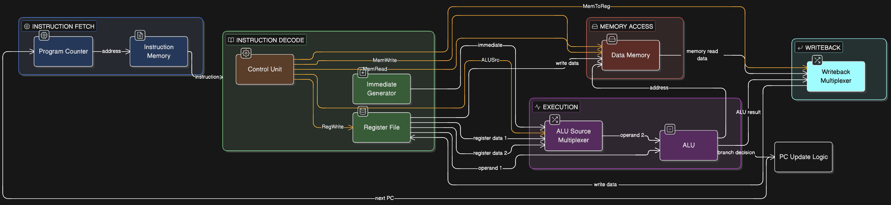

# Single-Cycle RISC-V Processor (RV32I Subset)

A 32-bit single-cycle processor implementing a subset of the RISC-V Instruction Set Architecture (ISA). This project was designed from scratch using Verilog and verified with GTKWave and IVerilog.

## 🚀 Overview
This processor executes instructions in a single clock cycle. It includes a complete datapath and control unit capable of handling arithmetic, logic, and memory operations.

### Supported Instructions
* **R-Type:** `ADD`
* **I-Type:** `ADDI`, `LW`
* **S-Type:** `SW`

## 🛠 Architecture
The design follows the classic Harvard Architecture, separating Instruction and Data memory.



### Key Components:
* **Program Counter (PC):** Manages the execution flow.
* **Control Unit:** Decodes 7-bit opcodes to drive the datapath.
* **ALU:** Handles 10+ operations including arithmetic and bitwise logic.
* **Register File:** Supports 32 general-purpose registers (x0 hardwired to 0).
* **Data Memory:** 4KB of RAM for variable storage.

## 📊 Verification
The processor was verified using a custom testbench that executes a "Read-After-Write" program suite.

### Simulation Results

The waveform above demonstrates:
1. **Instruction Fetch:** Incrementing PC and valid hex instructions.
2. **ALU Accuracy:** Successful execution of `ADD` and `ADDI` operations.
3. **Memory Integrity:** Successful `SW` (Store) followed by `LW` (Load) to the same address.

## 💻 How to Run
1. Ensure `iverilog` and `gtkwave` are installed.
2. Compile the design:
   ```bash
   iverilog -o riscv_sim src/*.v test/top_tb.v
   vvp riscv_sim
   gtkwave sim/riscv_processor.vcd
   ```