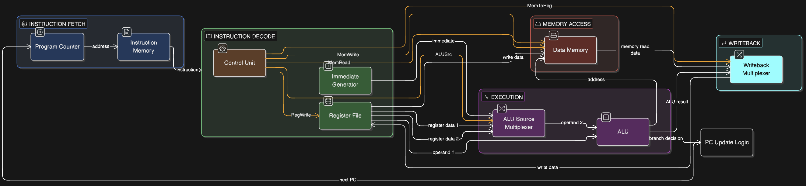

# 5-Stage Pipelined RISC-V Processor (RV32I Subset)

A 32-bit pipelined processor implementing a subset of the RISC-V Instruction Set Architecture (ISA). Designed from scratch in Verilog and verified with GTKWave and IVerilog.

## Overview

The processor executes instructions through a classic 5-stage pipeline: Instruction Fetch, Decode, Execute, Memory, and Write-Back. Multiple instructions are in-flight simultaneously, with hardware to correctly handle all data and control hazards.

### Supported Instructions
* **R-Type:** `ADD`, `SUB`, `AND`, `OR`
* **I-Type:** `ADDI`, `LW`
* **S-Type:** `SW`
* **B-Type:** `BEQ`

## Architecture

The design follows the Harvard architecture, with separate instruction and data memories.



### Pipeline Stages
| Stage | Module(s) | Description |
|---|---|---|
| IF | `pc.v`, `instruction_mem.v` | Fetch instruction, increment PC |
| ID | `control_unit.v`, `register_file.v` | Decode instruction, read registers, generate immediate |
| EX | `alu.v` | Execute ALU operation, compute branch target |
| MEM | `data_mem.v` | Read or write data memory |
| WB | (in `riscv_top.v`) | Select and write result back to register file |

### Hazard Handling
* **Forwarding unit** — detects RAW data hazards and routes results from EX/MEM or MEM/WB directly back to EX stage inputs, eliminating most stalls.
* **Hazard detection unit** — detects load-use hazards (LW followed immediately by a dependent instruction) and inserts a 1-cycle stall bubble.
* **Branch flushing** — detects taken branches at the end of EX and flushes the two incorrectly fetched instructions by zeroing IF/ID and ID/EX, then redirecting the PC to the branch target.

### Key Components
* **Program Counter:** Clocked register, holds or redirects on stall/branch.
* **Control Unit:** Decodes 7-bit opcode into datapath control signals.
* **ALU:** ADD, SUB, AND, OR.
* **Register File:** 32 x 32-bit general-purpose registers, x0 hardwired to zero.
* **Data Memory:** 4KB word-addressed RAM.

## Verification

The integration testbench (`test/top_tb.v`) runs a BEQ hazard program that exercises forwarding, branch detection, and flush:

```
ADDI x1, x0, 5      # x1 = 5
ADDI x2, x0, 5      # x2 = 5
BEQ  x1, x2, +8     # branch taken (x1 == x2); x1 and x2 forwarded into EX
ADDI x3, x0, 99     # flushed — never executes
ADDI x4, x0, 42     # re-fetched after branch; x4 = 42
```

Expected result: `x1=5, x2=5, x3=0, x4=42`.

## How to Run

1. Ensure `iverilog` and `gtkwave` are installed.
2. Compile and simulate:
   ```bash
   iverilog -o riscv_sim src/*.v test/top_tb.v
   vvp riscv_sim
   gtkwave riscv_processor.vcd
   ```
